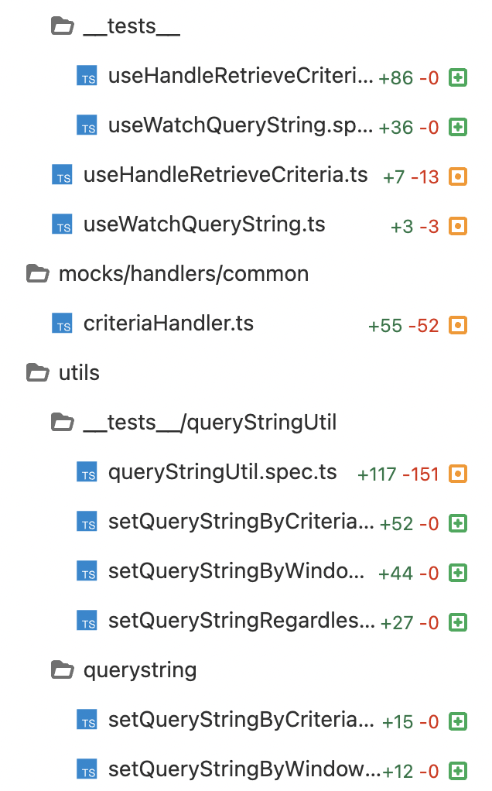

# 특수 문자 쿼리에 발생한 문제

진행중인 프로젝트에서 페이지네이션 요청 쿼리에 문제가 발생했다.

1. 불특정 특수문자가 불규칙적으로 인코딩 안됨  
   : '%', '\\', '\[' 등 인코딩 되어야 할 특수문자들이 인코딩 되지 않고 요청이 나감
2. null 대체 스트링 '%00' 이 가끔 '%2500' 으로 인코딩 됨
   : 'EMPTY' 대체 문자 '%00' 은 인코딩 되면 안되는데, '%2500' 으로 인코딩 됨
3. ' '(spacebar)가 새로고침하면 '+' 로 바뀜
   : 최초 페이지 진입시엔 저장된 ' ' 포함 쿼리가 잘 적용되지만, 새로고침을 하면 '+'로 바뀌어 적용됨

특히, 불특정 특수문자가 불규칙적으로 인코딩 안되는 문제는, 말 그대로 페이지 별로, 필터 별로, 문제가 생기는 지점을 특정하는데에 어려움이 있었다.

# 쿼리 업데이트 시 인코딩/디코딩 방식 불일치 문제

[필터, 페이지네이션에 따른 queryString 변화 흐름 파악 - flow chart](https://wiki.crscube.io/pages/viewpage.action?pageId=805538574)에 적어 두었듯, 쿼리를 업데이트하는 end-point 가 총 세 개가 있다.

1. 필터로 직접 수정
2. API로 저장되어있던 쿼리 요청
3. URL 에 포함되어 있던 쿼리 불러오기

각 end-point 에서 쿼리 인코딩 하는 방식을 종합해보면 총 세가지이다.

1. URLSearchParams.toString 을 사용한 인코딩
2. axios 인터셉트에서 설정한 query-string.js 를 사용한 인코딩
3. vue-router 의 push/replace 메서드에 기본 설정된 인코딩

쿼리를 디코딩 하는 방식은 다음과 같다

1. 쿼리스트링 유틸 메서드에서 사용하는 decodeURIComponent 메서드를 사용한 디코딩

axios 관련 설정은 다음과 같다.

```
axios.defaults.paramsSerializer = {
  serialize: (params) => {
    const flattenParams = ObjectUtils.flat(params, '', false);
    return queryString.stringify(flattenParams, {arrayFormat: 'comma'});
  }
};
```

URLSearchParams 를 사용한 인코딩은 'application/x-www-form-urlcecoded' 방식을 사용한다. ([MDN](https://developer.mozilla.org/en-US/docs/Web/API/URLSearchParams/URLSearchParams)).

vue-router 에선 percent_encoding 방식을 사용한다 ([MDN-Percent Encoding](https://developer.mozilla.org/en-US/docs/Glossary/Percent-encoding), [Vue-router docs](https://router.vuejs.org/guide/migration/#-route-properties-Encoding)).

# 단위 테스트 작성

쿼리스트링을 업데이트하는 메서드는 다양하다. 각 메서드가 알맞은 인코딩/디코딩 방식이 일치됐는지 수정 후 일일히 검사하지 않게 하기 위헤 메서드별 단위 테스트를 작성하였다.  
mr: https://gitlab.crsdev.io/ctms/ctms-webapp/-/merge_requests/896/  


테스트엔 vitest 와 vue-testing-library 를 사용하였다 (https://wiki.crscube.io/pages/viewpage.action?pageId=757714954)

# 인코딩/디코딩 방식 통일

상기했듯이, 적용되어있던 인코딩/디코딩 방식이 일치하지 않는 부분이 있다. query-string.js 라이브러리를 사용한 serializer, parser 메서드를 구현하여 axios, vue-router 에 적용하였고, 직접 수정하는 로직도 각각 수정하였다.

```
import { ObjectUtils } from '@/utils';
import QueryString from 'query-string';

export const stringifyQuery = (queryObject: Record<string, any>) => {
  const flattenParams = ObjectUtils.flat(queryObject, '', false);
  return QueryString.stringify(flattenParams, {arrayFormat: 'comma', strict: false});
};

export const parseQuery = (queryString: string): Record<string, any> => {
  if (queryString.length === 0) {
    return {};
  }

  return QueryString.parse(queryString);
};
```

```
// axios
axios.defaults.paramsSerializer = {
  serialize: stringifyQuery
};

// vue-router
const router = createRouter({
  history: createWebHistory(),
  routes,
  stringifyQuery
});
```

commit: https://gitlab.crsdev.io/ctms/ctms-webapp/-/merge_requests/906/diffs?commit_id=b34e944640a1624cfa8107fb3fd37f3e8ae4569d#d5ef75b923c05044aef6d710e719bed6453e8184
